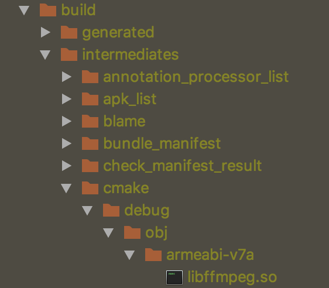

### 拷贝ffmpeg生成的so
编译ffmpeg生成so之后，将so文件拷贝到libs/armeabi-v7a
将头文件拷贝到sr/main/cpp/include下
编写cmakelist.txt以及ffmpeg.cpp文件之后

### 修改gradle文件
android/defaultconfig 添加
```
externalNativeBuild{
    cmake{
        abiFilters "armeabi-v7a"
    }
}
```

### 编译报错
- 出现类似：fatal error: 'libavutil/avconfig.h' file not found

删除"libavutil/"

- error: undefined reference to 'av_version_info()'

将#include <avutil.h>放在extern "C" 里边

- missing and no known rule to make it

android/defaultconfig 添加
```
externalNativeBuild{
    cmake{
        abiFilters "armeabi-v7a"
    }
}
```

编译生成的so路径如下：




### 运行
将so拷贝到libs/armearbi-v7a中
注释掉
```
externalNativeBuild {
    cmake {
        path file('src/main/cpp/CMakeLists.txt')
    }
}
```
添加
```
sourceSets {
    main{
        jniLibs.srcDirs = ["libs"]
    }
}
```    

- 点击run生成的apk没有so文件，make module生成的apk有so文件
添加
``` 
ndk{
    abiFilters "armeabi-v7a"
}
```

- java.lang.UnsatisfiedLinkError: dlopen failed: library "libavutil-55.so" not found

- 编译so的时候报错：
More than one file was found with OS independent path 'lib/armeabi-v7a/libffmpeg.so'
注释掉以下内容
```
//    sourceSets {
//        main{
//            jniLibs.srcDirs = ["libs"]
//        }
//    }
```