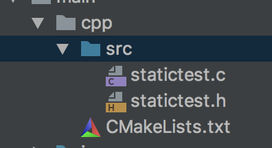
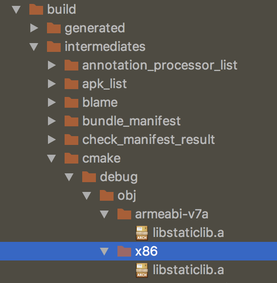

# Android cmake生成静态库


### 前提

使用android studio生成native工程或者自己生成cmakelist.txt以及在gradle中配置路径。

---

### CMakeList.txt配置
    #设置最小版本
    cmake_minimum_required(VERSION 3.4.1)
    
    add_library(
            staticlib # 库名称
            STATIC  # 设置库作为**静态库**
            src/statictest.c # 提供相对与CMakeLists.txt**相对**路径native代码(**不需要包含.h**)
            )
    # 链接库
    target_link_libraries(staticlib)

### 添加.h文件

    #ifndef JNIDEMOS_STATICTEST_H
    #define JNIDEMOS_STATICTEST_H
    
    #ifdef _cplusplus
    extern "C"{
    #endif
        int staticLibAdd(int a,int b);
    #ifdef _cplusplus
    };
    #endif
    #endif //JNIDEMOS_STATICTEST_H

### 添加.c文件

    #include "statictest.h"
    
    int staticLibAdd(int a,int b){
        return a+b;
    }
    native代码结构如下

### 修改gradle
gradle中android/defaultConfig中添加如下代码

```
externalNativeBuild{
    cmake{
        abiFilters "armeabi-v7a","x86"
        targets "staticlib" //**添加这个之后make mode才会生成静态库**
    }
}
```


### 编译生成静态库
点击菜单make mode按钮即刻生成.a文件,路径如下



