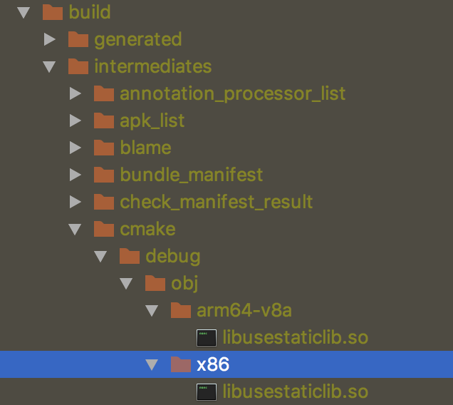

### Android cmake使用静态库

android中使用静态库，最终还是将静态库链接到动态库里，通过使用so的方式调用。

### 修改CmakeList.txt
```
cmake_minimum_required(VERSION 3.4.1)
add_library(usestaticlib # 生成的动态库名称
        SHARED # 库的类型
        userstatic.cpp# 库的源码相对本文件的路径
        )

add_library(
        staticlib # 引入的静态库库名称
        STATIC  # 设置库作为静态库
        IMPORTED # 引入)
set_target_properties(staticlib PROPERTIES IMPORTED_LOCATION
        ${CMAKE_CURRENT_SOURCE_DIR}/../../../libs/${CMAKE_ANDROID_ARCH_ABI}/libstaticlib.a# 设置静态库路径，必须是绝对路径
        )

target_include_directories(usestaticlib PRIVATE
        ${CMAKE_CURRENT_SOURCE_DIR}/include) # 设置.h文件位置

# 链接库
target_link_libraries(
        usestaticlib
        staticlib)
```
### 修改android/defaultconfig中内容
```
externalNativeBuild{
    cmake{
        abiFilters "arm64-v8a","x86" // **必须添加这行**，否则报***missing and no known rule to make it的错误
    }
}
```
### 编译
点击make mode，生成so文件



### 使用so
注释掉gradle以下代码
```
//externalNativeBuild {
//        cmake {
//            path file('src/main/cpp/CMakeLists.txt')
//        }
//    }
```
gradle添加以下代码
```
sourceSets {
    main{
        jniLibs.srcDirs = ["libs"]
    }
}
```
运行就可以看到效果了。


### 过程中遇到的问题

- __cplusplus 是两个下划线，只有一个下滑线会报错：undefined reference to ***

- 需要添加才会在生成apk中打入so
```
sourceSets {
    main{
        jniLibs.srcDirs = ["libs"]
    }
}
```
    